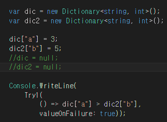
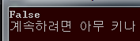
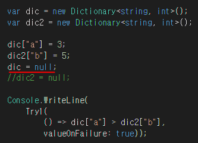
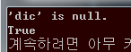
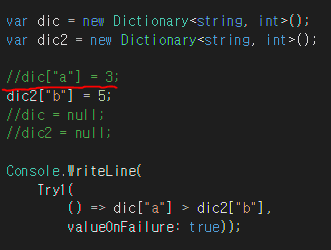
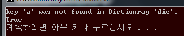

SafeSharp
====

불친절한 익셉션 메세지<br>
* [x] 어디서
* [ ] 누가
* [ ] 무어를

```
System.Collections.Generic.KeyNotFoundException: 지정한 키가 사전에 없습니다.
   위치: System.Collections.Generic.Dictionary`2.get_Item(TKey key)
```

Usage
----
```cs
var ret =
    Try1( expression, defaultValue );
```
<br>
<br>
__정상__<br>
<br>
<br>
<br>
__NullPointerException__<br>
<br>
<br>
<br>
__KeyNotFoundException__<br>
<br>
<br>
<br>

* [x] Nougat
* [x] Muautteel 

Features
----

* Try

    ```cs
    var a = Try(() => dic["a"], 0);
    ```
    
* WriteLine

    ```cs
    Console.WriteLine(dic["a"]);
    Safe.WriteLine(dic["a"]);
    ```